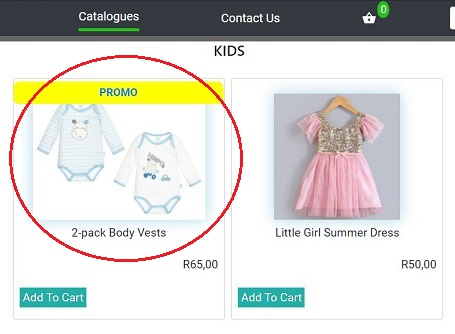

# OnlineStore

The OnlineStore is a web-based clothing store where customers can browse and purchase different clothing items for the family. 

This project is important as it affords customers the flexibility to visit the shop and buy their favourite apparel at their convenient time and from anywhere in the world as long as they are connected to the internet. 

The OnlineStore allows the customer to browse various departments within the store. It also allows the customer to add items to the shopping cart, receive discounts and choose to collect the order or to have the order delivered.

## Installation of local copy
You will need a computer with the following minimum specifications:
* __Processor:__ 1 gigahertz (GHz) or faster processor
* __RAM:__ 1 gigabyte (GB) for 32-bit or 2 GB for 64-bit
* __Hard disk space:__ 16 GB for 32-bit OS or 20 GB for 64-bit OS

To save the project locally *(Windows)*:

1. Open __CMD__.
2. Change the current working directory to the location where you want to save the project.
3. Type the below command
    * $ git clone https://github.com/tinashedm/myStore.git
4. Press __Enter__ to create your local clone.
5. Exit __CMD__

## Using the local copy 

* Navigate to the directory where you saved the project.
* Double-click *index.html* file.
* Click the __Catalogues__ tab.
* Click on the image of the product you want to view. 
  
* On the product page, click __Add To Cart__ button.
    * An alert box will pop up showing cart total, press __OK__. 
      
* Click on the __Cart Basket__ to navigate to the shopping cart.
    
* Enter a valid __Coupon code__ for your purchase *(instructions on top of page)*
* Select __Collection__ or __Delivery__ for shipping type *(if delivery, select option)*
* Click __Confirm Order__ button

